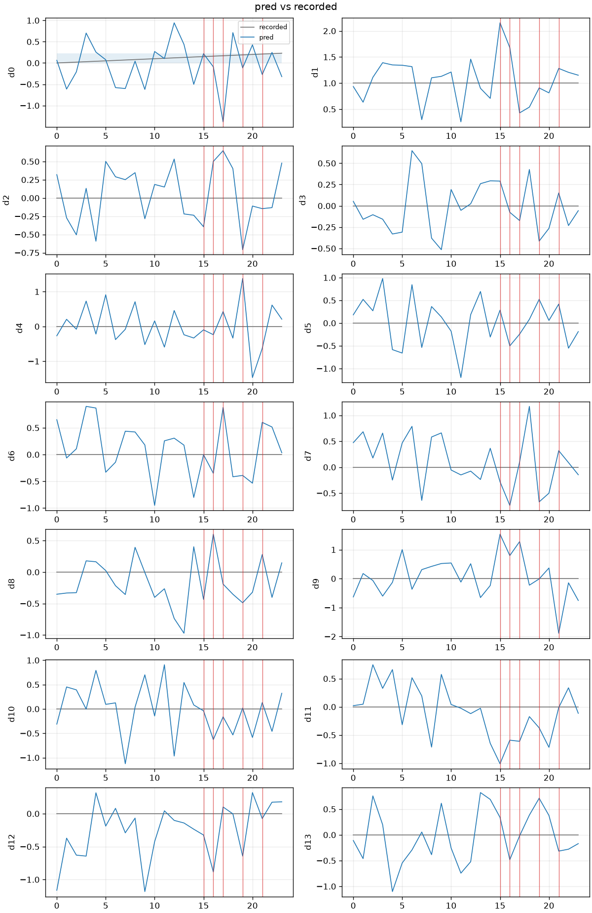

# 失败证据附件（2026-09-17）

断言红了之后，`runs/<id>/evidence/` 落下最差帧 PNG、预测/示教折线和 `evidence.json`。不是可视化 UI，也不复制 mp4。

## 远端

2026-09-16 22:45 CST 对 `microbo-gpu`（`connect.bjb2.seetacloud.com:38899`）`Connection refused`。发布 B 的两个真实 run（`aloha-static-coffee-ep0`、`coffee-published-action-space-mismatch`）还在实例磁盘上，本机没有 parquet。B' 权重本机仍有 `.cache/bprime/` 备份。

实例起来后：

```bash
bash scripts/remote/sync.sh push
ssh microbo-gpu 'bash /root/work/PhysicalAIInfra/scripts/remote/wrap.sh evidence \
  scenarios/real/aloha-static-coffee-ep0.yaml \
  $(ls -d /root/work/PhysicalAIInfra/runs/aloha-static-coffee-ep0__act-aloha-static-coffee-test* | tail -1) \
  --slice slices/aloha-static-coffee-ep0 --force'
ssh microbo-gpu 'bash /root/work/PhysicalAIInfra/scripts/remote/wrap.sh evidence \
  scenarios/real/coffee-published-action-space-mismatch.yaml \
  $(ls -d /root/work/PhysicalAIInfra/runs/coffee-published-action-space-mismatch__act-aloha-static-coffee-test* | tail -1) \
  --slice slices/coffee-published-action-space-mismatch --force'
bash scripts/remote/sync.sh pull runs/
```

预期：`skipped.frames` 为空（视频在 `HF_LEROBOT_HOME`），`actions.png` 14 维，最差帧有 `cam_high` / `cam_low` PNG。发布 B 的数字仍以 [2026-09-16-first-gate.md](./2026-09-16-first-gate.md) 为准：ep0 mean L2 ≈ 2.58，事故窗 ≈ 3.03。

## 本机格式样例

远端未恢复，先用 14 维 mock + `--noise 0.5` 走通同一条路径。相机帧按设计跳过（mock 的 `StepOut.images` 为 `None`）。



`evidence.json` 片段（完整见 [images/2026-09-17-evidence-sample.json](./images/2026-09-17-evidence-sample.json)）：

```json
{
  "mean_l2": 1.853,
  "worst_frames": [
    {"index": 17, "l2": 2.508, "files": []},
    {"index": 15, "l2": 2.350, "files": []}
  ],
  "bounds": {"n_frames_out": 24, "worst_frame": 17},
  "skipped": {"frames": "no images on adapter"}
}
```

干净 mock 回放不写 `evidence/`。`robogate evidence --force` 可事后从 parquet 重建图和 json。
