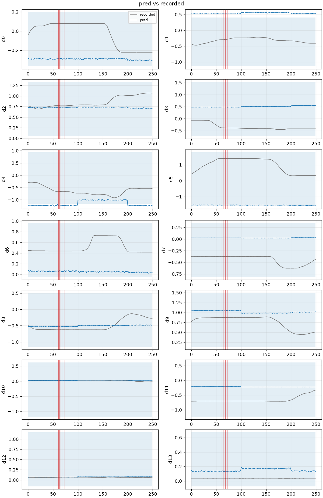
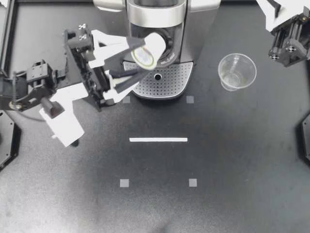

# 失败证据附件（2026-09-17）

断言红了之后，`runs/<id>/evidence/` 落下最差帧 PNG、预测/示教折线和 `evidence.json`。不是可视化 UI，也不复制 mp4。

2026-09-16 22:45 CST 远端 `Connection refused`。23:01 实例起来后，对发布 B 两个已有 run 跑了 `robogate evidence`（只读 parquet + 本地 mp4，没重放）。`skipped` 为空：视频在 `HF_LEROBOT_HOME`，Pillow / matplotlib / PyAV 都在。

## 发布 B 两个 run

| 项 | ep0 全集 | 事故窗 |
| --- | --- | --- |
| run | `…ep0__act-aloha-static-coffee-test__20260916T035830Z` | `…mismatch__act-aloha-static-coffee-test__20260915T070609Z` |
| 窗 | frames 0–1100 | 413–663（slice 内 0–250） |
| mean L2 | **2.584**（门槛 2.232） | **3.026**（门槛 2.232） |
| 最差帧 L2 | 3.346 @ 544 | 3.341 @ 61（数据集帧 474） |
| bounds overflow | 0.204；出界维 `[1,4,5]` | 0.170；出界维 `[1,4]` |
| 相机 PNG | 5 帧 × 4 路 | 5 帧 × 4 路 |

数字对得上 [第一次门禁](./2026-09-16-first-gate.md)：窗内 mean L2 ≈ 3.03，overflow ≈ 0.170。折线是典型的解错空间：预测几乎是一条水平线，示教在动。

事故窗 `actions.png`（红竖线 = L2 top-5）：



同一窗最差帧 `cam_high`（slice 61）：



ep0 全集折线见 [2026-09-17-evidence-ep0-actions.png](./images/2026-09-17-evidence-ep0-actions.png)，最差帧相机 [frame 544 cam_high](./images/2026-09-17-evidence-ep0-frame0544-cam_high.png)。

`evidence.json` 片段（事故窗；全文 [mismatch](./images/2026-09-17-evidence-mismatch.json) / [ep0](./images/2026-09-17-evidence-ep0.json)）：

```json
{
  "mean_l2": 3.0256253103630097,
  "worst_frames": [
    {"index": 61, "l2": 3.341, "files": [
      "frame_0061_cam_high.png",
      "frame_0061_cam_left_wrist.png",
      "frame_0061_cam_low.png",
      "frame_0061_cam_right_wrist.png"
    ]}
  ],
  "bounds": {"n_frames_out": 250, "dims_out": [1, 4], "worst_frame": 137},
  "skipped": {}
}
```

## 怎么复跑

```bash
bash scripts/remote/sync.sh push
ssh microbo-gpu 'bash /root/work/PhysicalAIInfra/scripts/remote/wrap.sh evidence \
  scenarios/real/aloha-static-coffee-ep0.yaml \
  runs/aloha-static-coffee-ep0__act-aloha-static-coffee-test__20260916T035830Z \
  --slice slices/aloha-static-coffee-ep0 --force'
ssh microbo-gpu 'bash /root/work/PhysicalAIInfra/scripts/remote/wrap.sh evidence \
  scenarios/real/coffee-published-action-space-mismatch.yaml \
  runs/coffee-published-action-space-mismatch__act-aloha-static-coffee-test__20260915T070609Z \
  --slice slices/coffee-published-action-space-mismatch --force'
bash scripts/remote/sync.sh pull \
  runs/aloha-static-coffee-ep0__act-aloha-static-coffee-test__20260916T035830Z/evidence
```

本机 mock 格式样例仍在 [actions-mock.png](./images/2026-09-17-evidence-actions-mock.png)；干净回放不写 `evidence/`。
